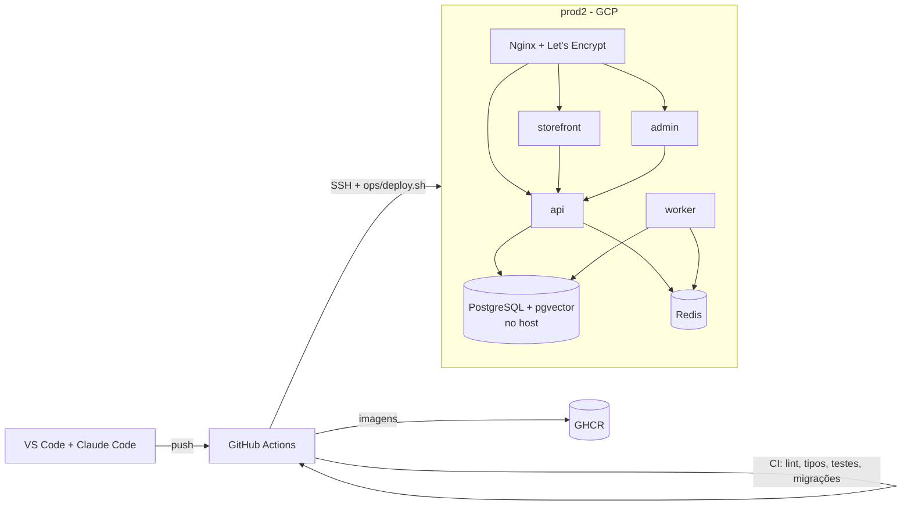

# Plataforma de Impressão 3D com IA

Monorepo da plataforma: catálogo autônomo de 720+ peças em 9 nichos, publicação em Mercado Livre e Shopee,
loja própria com IA, produção e notificações por WhatsApp. A especificação completa está em
[`docs/especificacao/prompt-impressao3d.md`](docs/especificacao/prompt-impressao3d.md); o contexto de trabalho em [`CLAUDE.md`](CLAUDE.md).

> **Nada roda localmente.** O código é editado no Windows e executado no servidor prod2 via CI/CD.

## Arquitetura (Fase 0)



Staging e produção são **stacks separadas** no mesmo servidor (compose com project names, bancos e subdomínios distintos).

## Estrutura

```
apps/        api · worker · storefront · admin · mobile (Fase 6.5)
packages/    core · ai · channels · notify · mesh · social · shared (TS)
infra/       docker/ · compose/ · nginx/
ops/         scripts do servidor (deploy, rollback, migrate, smoke, backup, ...)
tools/       guardas de CI
docs/        adr/ · fases/ · especificacao/ · runbook-ops.md · troca-de-marca.md
.github/     workflows (ci, cd), action remote-deploy, dependabot
```

## Documentação
- [Plano e checklist da Fase 0](docs/fases/fase-0.md)
- [ADRs](docs/adr/README.md) — decisões de arquitetura
- [Runbook de operação](docs/runbook-ops.md) — primeiro setup do servidor, secrets, DNS/HTTPS
- [Troca de marca](docs/troca-de-marca.md)
- [Dúvidas bloqueantes](docs/duvidas-bloqueantes.md)
